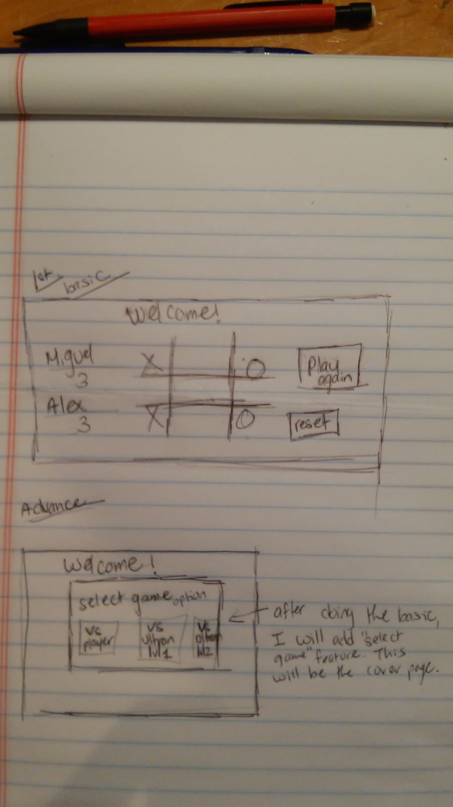

#Effects
The tiles change color when you hover over it. 
The users can add their name and choose whether they want to be x or o.

#Future add on

I hope to change the X and O with images, which was really hard. 
The tie function was hard to do and will have to really do that. 
Another thing I want to do is eliminate the tiles as the X and O are being placed on the tiles.
Also, work on adding tiles, making it 4x4 and 5x5. 

